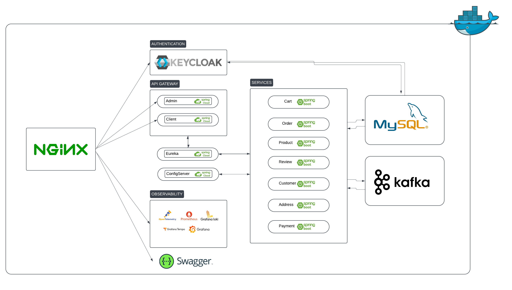

# Simple Shop

**SimpleShop** is a project created to practice building a microservices-based application in Java.
While simple in scope, it focuses on implementing the core principles of microservices architecture, including service
communication, scalability, resilience, and observability

## Development architecture

## Technologies, Frameworks, and Tools Utilized in Development

1. Technologies and Frameworks
    - Java 17
    - Spring Boot
    - Spring Cloud
    - Spring Security
    - Spring Cloud Functions
    - Spring Cloud Stream
    - resilience4j
    - OpenAPI specification
    - Swagger tools
    - Liquibase
2. Tools and Infrastructure
    - Docker
    - Helm
    - Kubernetes (K8s)
    - nginx
    - Testcontainers
    - GitHub Actions
3. Observability and Monitoring
    - Grafana
    - OpenTelemetry
    - Prometheus
    - Loki
    - Tempo

## Project Goals:

1. One Codebase, One Application
   : one-to-one correspondence between an application and its codebase, meaning each application has a dedicated
   codebase. Shared library allow to be utilized as a dependency for other applications. It's possible to track each
   codebase in its own repository. Multiple deployments of same artifact can exist in different environments. It is
   unnecessary to rebuild the codebase for each environment-specific deployment.

    - Docker compose configuration unique to environment
    - Implement CI/CD pipelines using GitHub Actions.

2. API First
   : In cloud-native ecosystem, setup consist of various services that interact through APIs. Adopting and API-first
   approach during the design phase encourages a mindset aligned with distributed systems and promotes the division of
   work among multiple teams. Designing the API as a priority allows other teams to build their solutions based on that
   API when using the application as a backing service.

    - Use Swagger tools to design and document APIs.

3. Dependency Management
   : Explicitly declare and manage service dependencies.
   Each service must declare its dependencies in pom.xml and ensure proper isolation of
   these dependencies. By following this approach, we maintain a clear and controller dependency management process for
   our application.

    - Use Maven or Gradle for dependency management.
    - Containerize dependencies like databases and message brokers using Docker.

4. Design, Build, Release, and Run
   : Codebase progression from design to production deployment involves stages Design (Determine technologies,
   dependencies and tools for specific application features), Build (Compile and package the codebase with dependencies,
   creating immutable artifact. Unique id for the build is essential), Release stage (Combine the build with a specific
   deployment configuration. EAch release is immutable and uniquely identifiable.) and Run stage (Execute the
   application in the designated runtime environment using a specific release)

    - Use GitHub Actions for multi-stage pipelines.
    - Automate deployments using Helm and Kubernetes.

5. Configuration, Credentials, and Code
   : Separate configurations and credentials from the codebase.
   Store configurations (e.g., database URLs, API keys) in a centralized configuration server.

    - Implement Spring Cloud Config Server for centralized configuration management.
    - Use Kubernetes Secrets to securely manage sensitive credentials.

6. Logs
   : Treat logs as event streams.
   Description: Centralize logs from all services for real-time analysis and troubleshooting.

    - Use Grafana Loki for centralized log storage.

7. Disposability
   : Design services for quick startup and graceful shutdown.
   Ensure services handle termination signals gracefully for seamless scaling and deployment. A fast startup enables
   system elasticity, ensuring robustness and resilience.

    - Use Docker along with an orchestrator like kubernetes inherently satisfy this requirement.

8. Backing Services
   : Treat backing services as attached resources.
   Description: Backing services like databases and message brokers should be easily replaceable and not tightly coupled
   to the code.

    - Use Testcontainers to mock external services during development and testing.
    - Configure Spring Cloud Stream to handle communication with message brokers like RabbitMQ.

9. Environment Parity
   : Maintain consistency across development, staging, and production environments.
   Use containerization to replicate the production environment during development.

    - Use Docker Compose for local development environments.
    - Use Helm charts for consistent configuration across staging and production.

10. Administrative Processes
    : Management tasks required to support applications, such as db migrations, batch jobs or maintenance tasks should
    be treated as isolated processes. Similar to application processes, the code for these administrative tasks should
    be version controlled, packaged alongside the application and executed withing same environment.

    - Use Liquibase to handle database migrations programmatically.
    - Schedule and execute one-off tasks using Kubernetes Jobs.

11. Port Binding
    : Export services via port binding for standalone operation.
    Description: Each service must be self-contained, exposing its functionality through ports.
    Actions:

    - Configure port binding in Spring Boot (server.port) for each service.
    - Use nginx and api gateway to route external traffic to appropriate services.

12. Stateless Processes
    : Design stateless services for scalability.
    Description: All state should be stored in external databases or caches. Services should not depend on in-memory
    state.

    - Use Redis for caching external states.
    - Store data in shared storage like a database.

13. Concurrency
    : Scale services horizontally by running multiple instances.
    Description: Deploy multiple instances of each service to distribute load effectively.
    Actions:

    - Use Kubernetes Horizontal Pod Autoscaler to scale services dynamically.
    - Load balance traffic with nginx or Kubernetes Ingress.

14. Telemetry
    : Monitor application performance and behavior.
    Description: Implement observability to capture metrics, logs, and traces for all services.
    Actions:

    - Use Prometheus for metrics collection.
    - Integrate OpenTelemetry for distributed tracing.
    - Visualize metrics and traces using Grafana and Grafana Tempo.

15. Authentication and Authorization
    : Secure the application with robust authentication and authorization mechanisms.
    Description: Implement centralized user management and authentication.
    Actions:

    - Use Keycloak for managing authentication and roles.
    - Protect endpoints using Spring Security with role-based access control.

## TODO:

- [ ] Keycloak auth
- [ ] Cart service
- [ ] Order service
- [ ] Product service
- [ ] Address service
- [ ] Review service
- [ ] Customer service
- [ ] Payment service
- [ ] Eureka Service Registry (Client-side service discovery)
- [ ] Admin API gateway
- [ ] Client API gateway
- [ ] Config Server

